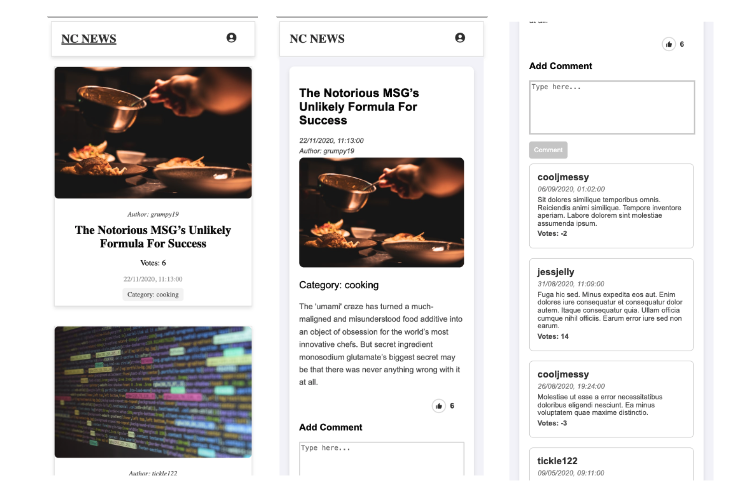
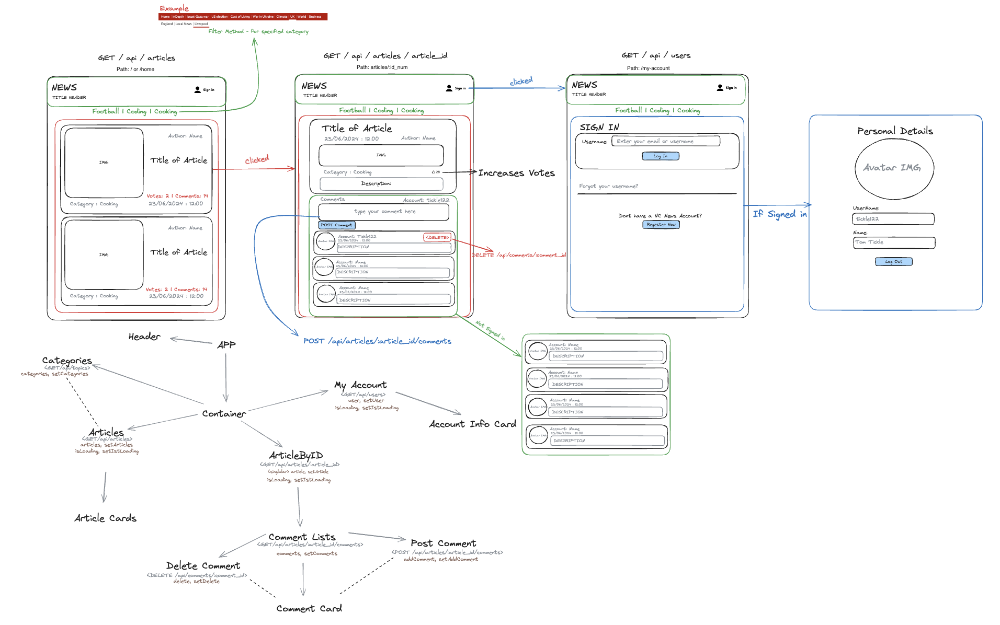

# NC NEWS

[**NC NEWS**](https://nc-news-front-end99.netlify.app) is a platform for social news aggregation, web content rating, and discussion, similar to Reddit. Users can share articles, comment on posts, and vote articles up or down.

The project is built using **React**, styled with **Vanilla CSS**, and hosted on **Netlify**: [https://nc-news-front-end99.netlify.app](https://nc-news-front-end99.netlify.app/).

Details of the back-end can be found on [GitHub](https://github.com/bryanrafosala/be-nc-news).


## Running Locally

To run this project locally:

1. Clone the repository:

   ```bash
   git clone https://github.com/bryanrafosala/fe-nc-news.git
   ```

2. Install the dependencies:

   ```bash
   npm install
   ```

3. Start the development server:

   ```bash
   npm run dev
   ```

Note: This project was built and tested with Node.js v21.6.1.

## Development Process

Before development, I created a wireframe and component tree to plan out the structure of the app. I also identified the API endpoints needed for each component, ensuring efficient state management and data passing via props.





---

This portfolio project was completed as part of the Software Engineering Digital Skills Bootcamp provided by [Northcoders](https://northcoders.com/).
